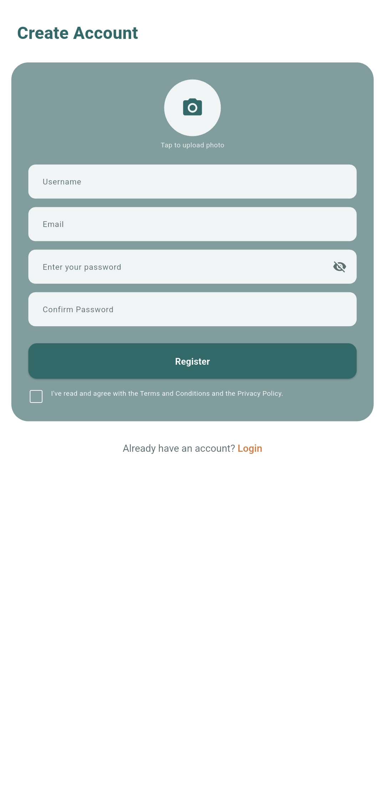
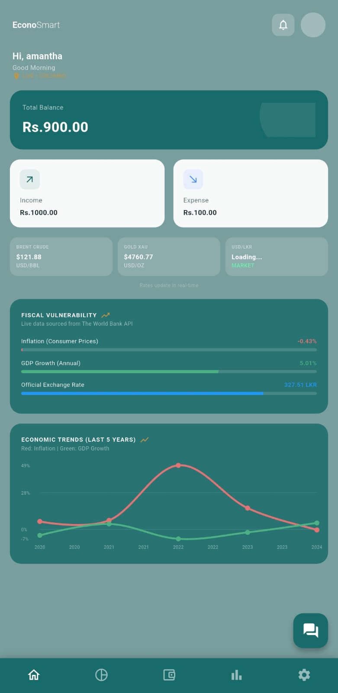
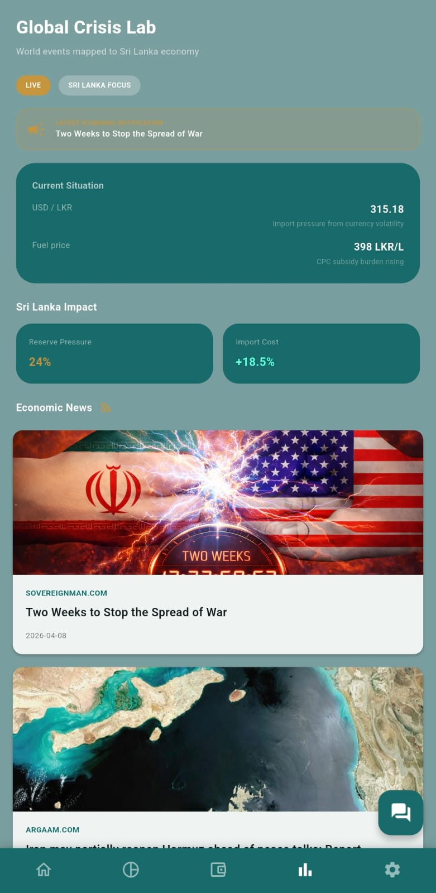
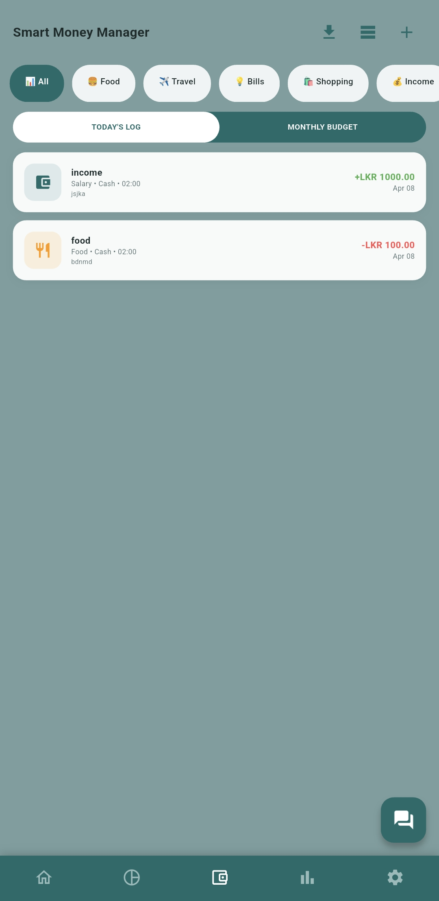
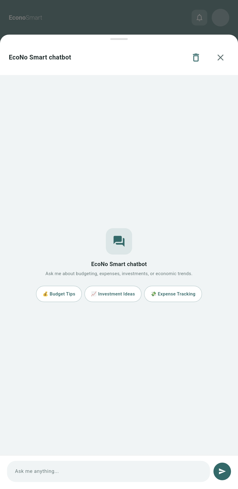

# 📊 Econo Smart Lanka.

**Econo Smart Lanka** is a comprehensive mobile application designed to simplify personal money management and keep you updated with the latest financial markets. Built with Flutter and powered by Firebase, the app provides real-time economic insights by integrating multiple financial APIs. Track your expenses, monitor live exchange and gold rates, and analyze global markets with interactive charts and curated news feeds—all in one place.

---

## ✨ Features.

* **Personal Finance Management:** Track your daily income and expenses seamlessly to stay on top of your financial health.
* **Real-Time Exchange Rates:** View the latest global currency exchange rates instantly.
* **Live Gold Prices:** Monitor live fluctuations in the precious metals market.
* **Market Analysis & Charts:** Deep dive into global financial markets with interactive charts and indices.
* **Live Financial News:** Stay informed with real-time, curated financial news feeds relevant to global economies.

---

## 🛠️ Tech Stack.

* **Frontend:** [Flutter](https://flutter.dev/) (Dart) for a seamless cross-platform experience (iOS & Android).
* **Backend & Database:** [Firebase](https://firebase.google.com/) (Firestore, Realtime Database, and Authentication).
* **Third-Party APIs:**
    * [Exchange Rate API](https://www.exchangerate-api.com/) - Currency conversions and live rates.
    * [Gold API](https://www.goldapi.io/) - Real-time precious metals pricing.
    * [Alpha Vantage API](https://www.alphavantage.co/) - Stock market data and technical indicators.
    * [Finnhub API](https://finnhub.io/) - Real-time market data, quotes, and market analysis.
    * [MarketAux API](https://marketaux.com/) - Global financial news feeds and sentiment analysis.

---

## 🚀 Getting Started.

Follow these steps to set up the project locally on your machine.

### Prerequisites
* [Flutter SDK](https://docs.flutter.dev/get-started/install) installed on your machine.
* A Firebase project set up via the Firebase Console.
* API keys registered for all the services mentioned in the Tech Stack.

### Installation.

1. **Clone the repository:**
   ```bash
   git clone https://github.com/kdsmaduranga/Econo_smart.git
   cd Econo_smart
   ```

2. **Install Flutter dependencies:**
   ```bash
   flutter pub get
   ```

3. **Configure Firebase:**
   * Add your `google-services.json` (Android) to the `android/app/` directory.
   * Add your `GoogleService-Info.plist` (iOS) to the `ios/Runner/` directory.

4. **Set up API Keys:**
   * Create a `.env` file in the root directory.
   * Add your API keys securely:
     ```env
     EXCHANGE_RATE_API_KEY=your_exchange_key_here
     GOLD_API_KEY=your_gold_key_here
     ALPHA_VANTAGE_KEY=your_alpha_key_here
     FINNHUB_KEY=your_finnhub_key_here
     MARKETAUX_KEY=your_marketaux_key_here
     ```

5. **Run the app:**
   ```bash
   flutter run
   ```

---

## 📱 Preview.

<table>
  <tr>
    <td align="center">
      
      <br />
      <em>SignIn</em>
    </td>
    <td align="center">
      
      <br />
      <em>SignUp</em>
    </td>
    <td align="center">
      
      <br />
      <em>Home Screen</em>
    </td>
  </tr>
  <tr>
    <td align="center">
      
      <br />
      <em>Crisis Lab</em>
    </td>
    <td align="center">
      
      <br />
      <em>Income and Expense Tracker</em>
    </td>
    <td align="center">
      
      <br />
      <em>AI Assistance</em>
    </td>
  </tr>
</table>
